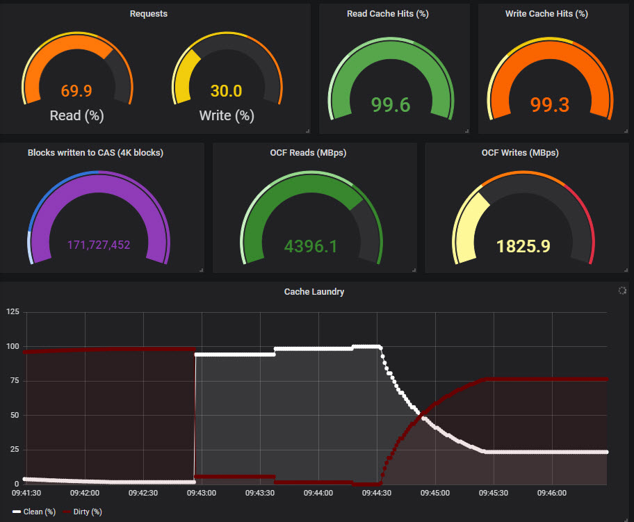
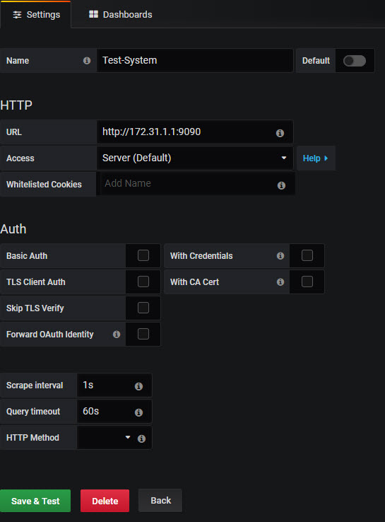
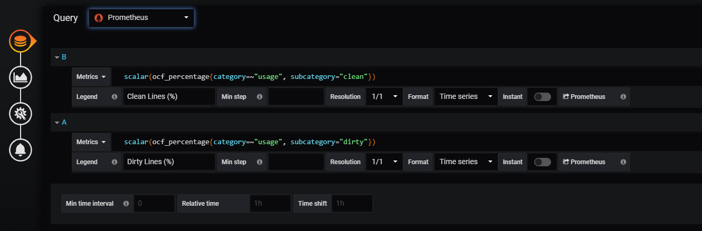
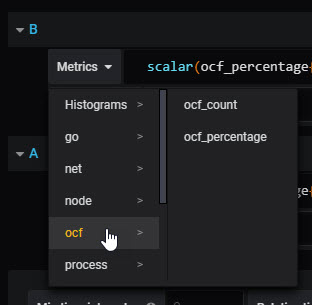

# CAS_Exporter
Exports Open CAS Linux statistics to Prometheus for inclusion in Grafana dashboards

Open CAS Linux is available here: https://github.com/Open-CAS/open-cas-linux

## Example
The following image is from a Grafana dashboard showing the OCF Exporter tool data being graphed via Prometheus


## Usage
cas_exporter [-port=PORT_NUMBER] | [-cache=INSTANCE_NUMBER] |  
            [-log] | [-logfile=FULL_PATH_TO_LOG]  |  
            [-sleep=SECS_TO_SLEEP_BETWEEN_ITERATIONS] 
            

| Option   |        Argument       |  Description |
|----------|:---------------------:|--------------|
| -port    | PORT_NUMBER           | The TCP port number spdk_parser will bind to in order to publish metrics  |
| -cache   | INSTANCE_NUMBER       |   The number of the cache instance to get statistics for |
| -log     |                       | Enable logging     |
| -logfile | FULL_PATH_TO_LOG      |    The path to the log file where output will be sent to when log is enabled  |
| -sleep   | SECS_TO_SLEEP         |    The number of seconds to sleep between iterations of metric gathering  |


## Instructions
This tool is written in Go and has been tested with Red Hat Linux 7.5  
Open CAS Linux should be installed and configured. If not, follow instructions available here: https://open-cas.github.io/getting_started_open_cas_linux.html


To use follow these general instructions (it is assumed the home directory is */root*. Adjust as necessary):  
1.  To view system metrics, such as CPU utilization, CPU IO wait, device latency, etc., the well-known plugin *Node Exporter* can be used.  
>```cd /root ```  
>```wget https://github.com/prometheus/node_exporter/releases/download/v0.18.1/node_exporter-0.18.1.linux-amd64.tar.gz```  
>```tar xvzf node_exporter-0.18.1.linux-amd64.tar.gz```  

Launch node exporter in the background  
>```nohup /root/node_exporter-0.18.1.linux-amd64/node_exporter &```  


2. Next, install Prometheus  
>```cd /root ```  
>```wget https://github.com/prometheus/prometheus/releases/download/v2.10.0/prometheus-2.10.0.linux-amd64.tar.gz```  
>```tar xvzf prometheus-2.10.0.linux-amd64.tar.gz```  
  

3. Determine what port to use for the CAS Exporter (default is 2114).  Edit the *prometheus.yml* file and edit the line that contains "static_configs:". Add to this line the address:port of CAS Exporter ('localhost:2114' for example) as well as the default Node Exporter ('localhost:9100').    
>```cd prometheus-2.10.0.linux-amd64```  
>```vi prometheus.yml```  
  
>> static_configs:
>>            - targets: ['localhost:9090', 'localhost:2114', 'localhost:9100']

4. Start Prometheus  
>``` ./prometheus & ```  

5. If you do not have the Go environment get it with:  
>> ```cd /root ```  
> ```wget https://dl.google.com/go/go1.13.3.linux-amd64.tar.gz```  
> ```tar -C /usr/local -xzf go1.13.3.linux-amd64.tar.gz```  
> ```export PATH=$PATH:/usr/local/go/bin```  

6. Install the Prometheus API for Go  
>```go get github.com/prometheus/client_golang/prometheus```  
>```go get github.com/prometheus/client_golang/prometheus/promauto```  
>```go get github.com/prometheus/client_golang/prometheus/promhttp```  

7. Clone CAS Exporter
> ```mkdir -p /root/go/src```  
> ```cd /root/go/src```  
> ```git clone https://github.com/felipe-barajas/CAS_Exporter ```

8. Compile CAS Exporter  
> ``` cd CAS_Exporter ```  
> ``` go build cas_exporter.go ```  
  
9. Run CAS Exporter using the port defined above (2114), getting CAS stats for cache instance *1*, logging data to /tmp/cas_exporter.out and sleeping 1 sec between metric recordings  
> ```nohup ./cas_exporter -port=2114 -cache=1 -log -logfile="/tmp/cas_exporter.out" -sleep=1 & ```    

Alternatively, CAS Exporter or Node Exporter can be launched via systemctl as services instead of launching them in the background.
To do that move the right executable to */usr/local/bin* for example:  
>```cp /root/node_exporter-0.18.1.linux-amd64/node_exporter /usr/local/bin/```  

Then create a user which will own this executable  
>```useradd -rs /bin/false node_exporter```  
>```chown node_exporter:node_exporter /usr/local/bin/node_exporter```

Next, create a service file, for example, *node_exporter.service* in the */etc/systemd/system* folder which should contain the service  
>```vi /etc/systemd/system/node_exporter.service```  

Write the contents:  
>>[Unit]  
>>Description=Node Exporter  
>>After=network-online.target  
>>  
>>[Service]  
>>User=node_exporter  
>>Group=node_exporter  
>>Type=simple  
>>ExecStart=/usr/local/bin/node_exporter  
>>  
>>[Install]  
>>WantedBy=multi-user.target  

Next, start the service with:  
>```systemctl daemon-reload```  
>```systemctl start node_exporter```

To start the service automatically after a reboot:  
>```systemctl enable node_exporter```  

To view the service status:  
>```systemctl status node_exporter```  

10. If you do not have Grafana installed, follow the instructions available here: https://grafana.com/docs/installation/rpm/
If you are unfamiliar with Grafana, follow the basic instructions to get started here: https://grafana.com/docs/guides/getting_started/

Once Grafana is installed, launch a web browser (the default Grafana web service URL is http://localhost:3000) and log into the Grafana server to setup the newly created Prometheus source. The default port for the Prometheus server is 9090. For example:  


11. On the Grafana server create a dashboard and add a panel. The panel needs to point to the Prometheus data source created in the step above.  The metric query to use is one defined by CAS Exporter. See the next section for all the options.  For example, to see the instantaneous rate of the Reads from the CAS, use a metric query as shown in the picture below  


Alternatively, under the Metrics drop down menu, select the "ocf" section as shown below.

  
All the available metrics exposed by this tool will appear here. A sample dashboard is also provided in the *sample_dashboard.json* file. This file can be manaully edited and imported into Grafana as well. Note that the sample dashboard will have to be edited to fit your needs and to point to your source.


### CAS Exporter Queries Supported
The CAS metrics can be filtered using category and subcategory  
For example: ocf_percentage{category="requests", subcategory="rd_hits"}  

- Metric: ocf_count  
Description: OCF count value

- Metric: ocf_percentage  
Description: OCF percentage value 

For the two OCF metrics above, the supported categories are: 
- usage
- requests
- blocks 
- errors

The subcagetories for usage are: 
- occupancy  
- free   
- clean   
- dirty  

The subcategories for requests are: 
- rd_hits 
- rd_partial_misses
- rd_full_misses
- rd_total
- wr_hits
- wr_partial_misses
- wr_full_misses
- wr_total
- rd_pt
- wr_pt
- serviced 
- total.  

The subcategories for blocks and errors are: 
- core_volume_rd 
- core_volume_wr 
- core_volume_total 
- cache_volume_rd 
- cache_volume_wr 
- cache_volume_total 
- volume_rd 
- volume_wr 
- volume_total  
